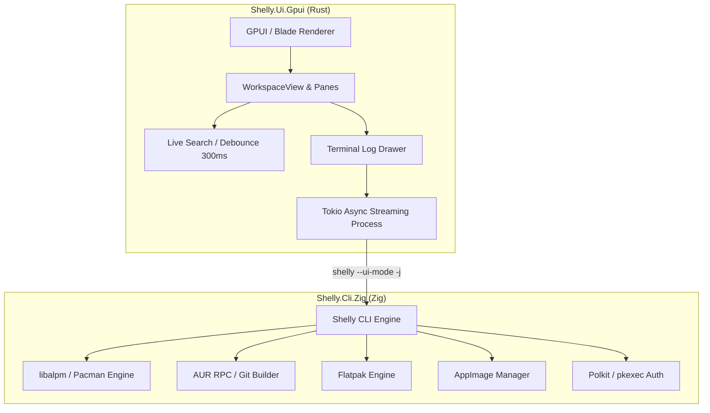

# ⚡ Shelly GPUI

<div align="center">

[](LICENSE)
[](https://www.rust-lang.org/)
[](https://ziglang.org/)
[](https://github.com/zed-industries/zed/tree/main/crates/gpui)
[](https://archlinux.org/)

**High-performance GPU-accelerated unified package manager for Arch Linux.**  
*Official repositories (ALPM), AUR, Flatpaks, and AppImages brought together in a fast, keyboard-first interface powered by GPUI.*

[Features](#-features) •
[Architecture](#-architecture) •
[Installation & Building](#-installation--building) •
[Keybindings & Usage](#-keybindings--usage) •
[Arch Linux Packaging (AUR)](#-arch-linux-packaging-aur) •
[Credits](#-credits)

</div>

---

## 🚀 Features

- ⚡ **Native Hardware GPU Acceleration**: Built on Zed's **GPUI 0.2** framework, rendering directly via Vulkan/Wayland/X11 with Blade Graphics at 120+ FPS.
- 📦 **Multi-Backend Package Management**:
  - **Official Arch Linux Repositories** (via `libalpm` engine)
  - **Arch User Repository (AUR)** (Git cloning, clean chroot builds)
  - **Flatpak Applications** (Flathub catalogs, runtimes, and metadata)
  - **AppImage Management** (directory indexing and lifecycle management)
- 🔍 **Interactive Live Search (`TextInput`)**: Non-blocking typing with 300 ms predictive debounce powered by GPUI's native background executor.
- 📋 **Rich Package Inspector**: Complete view of dependencies, optional dependencies, reverse dependencies ("Required by"), base packages, install reasons, licenses, and verified package sizes.
- 📟 **Embedded Terminal Log Drawer**: Collapsible lower drawer streaming live stdout/stderr transaction logs with Polkit privilege escalation.
- 🔄 **Automatic State Refresh**: Instant synchronization of update counters and active listings upon successful package installations, removals, or upgrades.
- 🎨 **Modern Catppuccin Mocha Theme**: Curated typography, high-contrast indicators, and distinctive source badges.

---

## 🏗 Architecture

Shelly GPUI enforces a strict separation of concerns between reactive GUI rendering and system transaction management:



- **Frontend (`Shelly.Ui.Gpui`)**: Native Rust application written with GPUI 0.2, managing vector GPU rendering, layout calculations, and reactive UI state.
- **Backend (`Shelly.Cli.Zig`)**: Native Zig CLI interacting directly with `libalpm.so` and external package sources. It outputs structured JSON for queries and framed streams via `--ui-mode` for live transaction logging.

---

## 🛠 Installation & Building

### Prerequisites

On Arch Linux or Arch-based distributions:

```bash
sudo pacman -S --needed base-devel git rust cargo zig pacman libglvnd fontconfig freetype2 wayland mesa vulkan-icd-loader polkit
```

### 1. Build and Run with `make`

The repository provides a root `Makefile` that automatically compiles the Zig backend and launches the GPUI frontend:

```bash
git clone https://github.com/tension-atoi/shelly-gpui.git
cd shelly-gpui

# Launch directly in development mode
make run

# Or build an optimized release binary
make build
```

Available `make` targets:
- `make run`: Compiles the Zig backend (if needed) and starts `cargo run` with the local CLI.
- `make build`: Generates the optimized release binary (`shelly-gpui`).
- `make check`: Runs fast static compilation checks without linking.
- `make install`: Installs the binaries and desktop integration files into `/usr/local`.
- `make package`: Builds and tests the Arch Linux package via `makepkg`.
- `make clean`: Cleans build artifacts for both Rust and Zig.

---

## ⌨ Keybindings & Usage

| Key / Action | Context | Description |
|---|---|---|
| **Click Search Bar** | Left Pane | Focuses the search input with visual cursor `▌` |
| **Type Query** | Search Bar | Triggers live search with automatic 300 ms debounce |
| **Enter** | Search Bar | Executes search immediately (bypasses debounce) |
| **Escape** | Search Bar | Clears query and releases keyboard focus |
| **Click Bottom Drawer** | Global | Expands or collapses the terminal log drawer |
| **Tab Buttons** | Top Navigation | Switches between ALPM, AUR, Flatpaks, AppImages, Updates, News, and Settings |

---

## 📦 Arch Linux Packaging (AUR)

Both [`PKGBUILD-gpui`](PKGBUILD-gpui) and [`packaging/aur/PKGBUILD`](packaging/aur/PKGBUILD) are provided for clean Arch Linux packaging:

```bash
# Build the package locally
makepkg -si --noconfirm
```

The package installs:
- `/usr/bin/shelly-gpui`: System wrapper script with automated environment discovery
- `/usr/lib/shelly/shelly`: Native Zig CLI engine
- `/usr/lib/shelly/shelly-gpui-bin`: GPU-accelerated Rust frontend binary
- `/usr/share/applications/com.shellyorg.shelly-gpui.desktop`: XDG desktop application entry
- `/usr/share/icons/hicolor/scalable/apps/shelly-gpui.svg`: Scalable Catppuccin vector icon
- `/usr/share/polkit-1/actions/com.shellyorg.shelly-gpui.policy`: Polkit authorization rules for seamless system operations

---

## 🤝 Credits & Acknowledgments

- [Seafoam-Labs/Shelly-ALPM](https://github.com/Seafoam-Labs/Shelly-ALPM) for the original Shelly package manager engine and ALPM / Zig architecture.
- [Zed Industries](https://github.com/zed-industries/zed) for the [GPUI](https://github.com/zed-industries/zed/tree/main/crates/gpui) framework.
- [Catppuccin](https://github.com/catppuccin/catppuccin) for the Mocha palette.

---

## 📄 License

This project is licensed under the **GPL-3.0 License**. See the [LICENSE](LICENSE) file for details.
