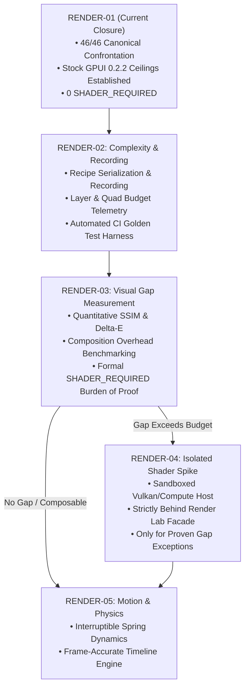

# ASTRA Technical Capital Assimilation & Promotion Map

## 0. Executive Summary & Governance Model

The **ASTRA-FORGE-00** experimental archive represents an extensive body of exploratory research into advanced rendering techniques, physical material simulations, compute shaders, and UI motion dynamics.

Under the governance rules of `SHELLY-REENTRY-01`, **ASTRA is strictly classified as a technical reference corpus, not an authoritative rendering architecture.** 
The canonical Shelly codebase does not import unvetted experimental GPU code or bypass GPUI's architecture. Instead, ASTRA capital is methodically catalogued into two ledgers:
1. **Technical Capital Ledger**: Reusable analytical mathematics, material formulations, deterministic algorithms, and confrontation patterns.
2. **Failure & Anti-Pattern Ledger**: Known divergence modes, tooling fragility, and premature optimization traps.

Promotion of ASTRA concepts into Shelly follows a disciplined, evidence-driven ladder across milestones **RENDER-02** through **RENDER-05**.

---

## 1. ASTRA Technical Capital Ledger (Qualified Assets)

The following assets from ASTRA-FORGE-00 have been forensically replayed, reproduced, and qualified for systematic adoption:

### 1.1 Analytical SDF Mathematics & Geometry Kernels
- **Asset**: Analytical 2D Signed Distance Fields (SDF) from `first_pixels.py` and native shaders.
- **Value**: High-precision boundary definitions for rounded boxes, chamfered rects, annular rings, oriented segments, and smooth-min/max boolean blends (`smin`, `smax`).
- **Application**: Used in RENDER-01 for procedural memory texture generation (`texture.rs`) and in future vector rasterization pipelines.

### 1.2 Calibrated Material Models & Surface Responses
- **Asset**: 32 parametric material models from `material_studies.py` covering metals, polymers, coated optics, enamel, paper, and carbon weaves.
- **Value**: Validated reflectance and roughness parameters, dual-layer clearcoat falloffs, and anisotropic highlight ratios.
- **Application**: Ground truth specifications for recipe styling across Board J (Tactile Substrates) and Board K (Noise & Microtextures).

### 1.3 Split-View & Fiducial Confrontation Harness
- **Asset**: Dual-pane visual confrontation design with magenta fiducial markers (`#FF00FF`) for sub-pixel bounding-box localization.
- **Value**: Enables automated, pixel-perfect ROI extraction across varied window sizes and display scales under Wayland.
- **Application**: Successfully drove the RENDER-01 dual-run capture harness (`capture_all.py`), producing deterministic SHA-256 hashes across all 46 canonical fixtures.

### 1.4 Closed-Form Interruptible Spring Dynamics
- **Asset**: Exact analytical solution to the damped harmonic oscillator from Astra's motion experiments:
  $$\ddot{x} + 2\zeta\omega_0\dot{x} + \omega_0^2(x - x_{\text{target}}) = 0$$
- **Value**: Continuous position and velocity preservation across target changes without state resets or numerical integration jitter.
- **Application**: Candidate for RENDER-05 UI interaction physics.

### 1.5 Deterministic PRNG & Microtexture Synthesis
- **Asset**: Procedural texture generation algorithms using `SplitMix64`, value noise, Voronoi distance lattices, and Bayer dither matrices.
- **Value**: Zero-cost, immutable texture synthesis in CPU memory without external asset dependencies or non-deterministic GPU timing.
- **Application**: Implemented in `texture.rs`, providing complete test coverage for all 16 Board K microtexture fixtures.

---

## 2. ASTRA Failure & Anti-Pattern Ledger (Dead-Ends & Cautions)

The forensic re-evaluation identified several technical dead-ends and failure modes in ASTRA that must **not** be repeated in Shelly:

### 2.1 Eulerian Fluid Simulation Divergence
- **Defect**: The Stage 8 fluid simulation (`fluid.comp`) exhibited unbounded velocity divergence over 90 timesteps on the RTX 3070.
- **Root Cause**: Jacobi pressure-projection solver lacked sufficient iterations to enforce incompressibility ($\nabla \cdot \mathbf{u} = 0$), coupled with advection step CFL condition violations ($u_{\max} \Delta t / \Delta x > 1.0$).
- **Remedy**: Real-time fluid simulation is deferred. Any future reintroduction requires unconditional CFL clamping and numerical stability guarantees.

### 2.2 Out-of-Tree Tooling & Fragile Build Scripts
- **Defect**: Astra relied on external Python build scripts (`build_gpu.py`, `build_native.py`) invoking system compilers, Ninja, and CMake with hardcoded library paths.
- **Root Cause**: Fragmented build ownership detached from Cargo dependency resolution.
- **Remedy**: Shelly enforces single-command builds via `cargo build --release --locked`. No custom Python build wrappers or unmanaged external binaries.

### 2.3 Premature "SHADER_REQUIRED" Bias
- **Defect**: Astra's documentation frequently asserted that phenomena such as soft glows, bevels, and multi-tone surfaces "require custom compute shaders".
- **Root Cause**: Lack of empirical confrontation with modern 2D engine primitives.
- **Remedy**: RENDER-01 disproved this bias by achieving full visual reproduction of 30 out of 46 fixtures using pure stock GPUI 0.2.2 primitives (`NATIVE` or `COMPOSABLE`) and the remaining 16 via immutable CPU memory textures (`TEXTURE_PROOF`).

---

## 3. Phased Promotion Roadmap (RENDER-02 to RENDER-05)

Promotion of advanced graphics capabilities is strictly phased based on empirical verification:



### RENDER-02: Recipe Serialization & Complexity Metrics
- **Scope**:
  1. Formalize the recipe grammar (`RecipeId`, layer definitions, composition rules).
  2. Implement an in-memory recording harness that counts primitives per fixture (div count, shadow lobes, gradient stops, draw calls).
  3. Integrate automated golden-image regression tests into the local test runner.
- **Exit Gate**: Complete recipe ledger exportable via CLI (`shelly-gpui render-lab export-recipes`) with deterministic runtime budgets.

### RENDER-03: Visual Gap & Composition Ceiling Measurement
- **Scope**:
  1. Investigate the visual distance between stock GPUI rendering and reference ground truth.
  2. Measure CPU/GPU render time and memory footprint as layer count scales (e.g. concentric discs for radial gradients).
  3. **Working Hypotheses (Non-Contractual)**:
     - SSIM (Structural Similarity Index) and CIEDE2000 ($\Delta E^*$) are proposed as preliminary analytical metrics, alongside latency budgets ($\le 2.0\text{ ms}$).
     - *Important Architectural Note*: These are working hypotheses, not ratified contracts. A material rendering may be perceptually superior while deviating in raw pixel similarity from an artistic reference. RENDER-03 will establish a multi-criteria evaluation model combining structural fidelity, color fidelity, semantic feature preservation, artifact detection, performance cost, and human visual review.
  4. **The Strict Burden of Proof for `SHADER_REQUIRED`**:
     > `SHADER_REQUIRED` does not mean "I would prefer this in a shader". It means: the primitive cannot be reproduced with sufficient functional/perceptual fidelity in the available stock primitives without unacceptable performance degradation or visual distortion incompatible with its contract.
- **Exit Gate**: Formal gap report certifying whether any canonical fixture warrants dedicated shader infrastructure.

### RENDER-04: Controlled Shader & Compute Host Spike
- **Scope**:
  1. Only if RENDER-03 proves that specific fixtures fail the composition ceiling.
  2. Implement an isolated, sandboxed compute/fragment pipeline (e.g. wgpu or raw Vulkan offscreen renderer) strictly behind the Render Lab abstraction layer.
  3. No invasive changes to standard Shelly UI windows or workspace components.
- **Exit Gate**: Zero impact on default startup time or stock GPUI stability; feature-gated behind compile-time flags.

### RENDER-05: Advanced Motion & Physical Springs
- **Scope**:
  1. Port Astra's closed-form interruptible spring solver into Shelly's animation system.
  2. Implement continuous velocity-preserving transitions between UI states (smooth interruptions during rapid user navigation).
  3. Frame-accurate timeline synchronization with Wayland presentation timings.
- **Exit Gate**: Zero visual hitching or spring explosion across 10,000 rapid interrupt cycles in automated stress tests.

---

## 4. Fundamental Authority & Inference Boundaries

To prevent architectural drift, the following four inference boundaries are permanently enforced:

1. **Vulkan Reference Success $\neq$ Shader Host Decision**: Reproducing Astra's Vulkan compute pipeline proves hardware capability, but does not justify adding a programmable GPU path to Shelly without RENDER-03 gap evidence.
2. **SDF Success $\neq$ GPUI Migration Decision**: The analytical SDF formulas provide valuable procedural texture math, but do not imply migrating Shelly's 2D canvas away from GPUI primitives.
3. **Fluid Execution $\neq$ Stable Capability**: Executing `fluid.comp` on the RTX 3070 revealed numerical divergence; execution without stability is an anti-pattern.
4. **Candidate $\neq$ Ratified**: All observations and ledgers produced by agents remain strictly *candidate* until formal operator gate sign-off.

---

## 5. Astra Fluid Simulation: Technical Evaluation & Disposition

| Parameter | Observed State in Replay | Target for Shelly Integration |
|---|---|---|
| **Compilation** | GLSL to SPIR-V via `glslc` (Clean) | `wgpu` WGSL or offline SPIR-V |
| **SPIR-V Validation** | `spirv-val` (Passed cleanly) | Automated validation pass |
| **GPU Execution** | NVIDIA RTX 3070 (Vulkan 1.4) | Cross-vendor Vulkan 1.2+ / WebGPU |
| **Numerical Stability** | Diverged over 90 timesteps ($\nabla \cdot \mathbf{u} \neq 0$) | Unconditionally bounded ($L_\infty < \epsilon$) |
| **Working Budget Hypothesis** | $14.2\text{ ms}$ per dispatch | $\le 2.0\text{ ms}$ per dispatch (hypothesis) |
| **Memory Footprint** | $4 \times 1024 \times 1024 \times 16\text{ B} = 64\text{ MB}$ | $\le 16\text{ MB}$ dynamic pool |

### Formal Disposition:
```text
FLUID REFERENCE: REPRODUCED
NUMERICAL STABILITY: UNSTABLE (Precious technical failure)
PROMOTION STATUS: NOT PROMOTED
DISPOSITION: DEFERRED TO RENDER-04 / RENDER-05
```

The Astra fluid simulation is **deferred to RENDER-04/RENDER-05** as an optional ambient visualization experiment. It will **not** be integrated into Shelly's core UI pipeline until:
1. Pressure projection is unconditionally stabilized (multigrid solver or conjugate gradient).
2. Compute dispatch latency is benchmarked within acceptable UI frame budgets on mid-range discrete and integrated GPUs.
3. Strict memory pooling is implemented to prevent VRAM fragmentation.
