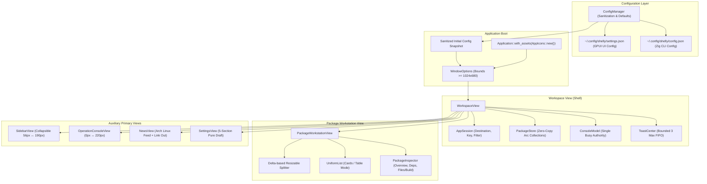

# Shelly GPUI — Slice-05 Current State

## 1. Architectural Architecture Overview

Following the execution of Slice-05, `shelly-gpui` possesses a clean, layered desktop architecture that coordinates between the underlying Zig CLI process engine and a high-performance GPUI frontend:

---

## 2. Module Inventory

| Module Path | Responsibility | Key Types / Constants |
|---|---|---|
| `src/main.rs` | Entrypoint, single config snapshot, window initialization, Tokio runtime guard | `main()`, `options` |
| `src/ui_metrics.rs` | Central geometry invariants for cards, tables, splitters, and sidebars | `UiMetrics`, `CARD_HEIGHT_*`, `ROW_HEIGHT_*` |
| `src/icons.rs` | Compile-time SVG asset loader & icon enum | `AppIcon` (22 variants), `AppIcons: AssetSource` |
| `src/config.rs` | Serialization, default fallbacks, and window size sanitization | `GpuiUiConfig`, `ShellySettings`, `ConfigManager` |
| `src/theme.rs` | High-contrast dark and light theme palettes | `Theme::dark()`, `Theme::light()` |
| `src/backend/client.rs` | Asynchronous IPC with Zig CLI (`shelly`) subprocess | `ShellyClient`, `install_package`, `remove_package` |
| `src/backend/models.rs` | Data transfer models for ALPM, AUR, Flatpak, AppImage, and News | `UnifiedPackage`, `ArchNewsItem`, `AlpmPackage` |
| `src/backend/process.rs` | Process execution runner and streaming log event receiver | `ProcessRunner`, `LogStreamEvent` |
| `src/state/session.rs` | Intent and navigation state, search queries, destination tracking | `AppSession`, `NavDestination`, `SourceFilter` |
| `src/state/package_store.rs` | Collections storage (`Arc<[UnifiedPackage]>`), generation cache | `PackageStore`, `SearchKey`, `PackageKey` |
| `src/state/console.rs` | Execution authority and streaming subprocess log buffer | `ConsoleModel`, `ConsoleEvent`, `is_running()` |
| `src/state/motion.rs` | Standardized duration tokens and interruptible continuous scalars | `MotionPolicy`, `MotionDurations`, `AnimatedScalar` |
| `src/state/semantic.rs` | Domain parsing for dependencies, capabilities, and install commands | `DependencyRef`, `PackageCapabilities` |
| `src/state/toast.rs` | State machine for bounded non-blocking notifications | `ToastCenter`, `ToastItem`, `ToastLifecycle` |
| `src/components/sidebar.rs` | Collapsible navigation sidebar with embedded vector icons | `SidebarView`, `SidebarProps` |
| `src/components/log_drawer.rs` | Streaming execution output terminal with auto-disclosure | `LogDrawer`, `LogDrawerProps` |
| `src/components/unified_search.rs` | Search input, dynamic filter pills, and search state feedback | `UnifiedSearch`, `UnifiedSearchProps` |
| `src/components/view_mode_switcher.rs` | Segmented toggle for Cards vs Table presentation modes | `ViewModeSwitcher`, `ViewModeSwitcherProps` |
| `src/components/package_card.rs` | Compact and normal density card item for virtual list | `PackageCard`, `PackageCardProps` |
| `src/components/package_table.rs` | Dense tabular list row with sortable columns | `PackageTable`, `PackageTableProps` |
| `src/components/inspector_header.rs` | Hero header with action buttons, install/remove mutation dispatch | `InspectorHeader`, `InspectorHeaderProps` |
| `src/components/semantic_value.rs` | Copyable metadata rows with visual copy feedback | `SemanticValue`, `SemanticValueProps` |
| `src/components/toast_overlay.rs` | Non-blocking notification presentation layer | `ToastOverlay`, `ToastOverlayProps` |
| `src/views/workspace.rs` | Root UI container orchestrating session, workstation, and modals | `WorkspaceView`, `with_config`, `save_settings` |
| `src/views/package_workstation.rs` | Splitter-isolated container for virtual list and inspector | `PackageWorkstationView`, `compute_splitter_width` |
| `src/views/operation_console.rs` | Isolated animated container for terminal log drawer | `OperationConsoleView`, local RAF loop |
| `src/views/news.rs` | Arch Linux official news announcements with external browser links | `NewsView`, `NewsViewProps` |
| `src/views/settings.rs` | 5-section pure draft configuration view | `SettingsView`, `SettingsViewProps` |
| `src/views/inspector/*.rs` | Decomposed inspector panels for Overview, Dependencies, and Files | `OverviewView`, `DependenciesView`, `FilesBuildView` |

---

## 3. Key Upgrades from Slice-04

1. **Elimination of Emoji Glyphs**:
   - Replaced all unicode emoji icons (sidebar, search bar, table/card switchers, inspector tabs, log drawer, toast alerts) with 22 dedicated, compile-time embedded SVG vector assets.
2. **Unified Density Pipeline**:
   - Centralized all layout heights into `UiMetrics`. Enabling `compact_view` in Settings now adjusts card wrapper heights from 78px to 68px, table rows from 36px to 32px, and collapses the sidebar from 190px to 56px simultaneously.
3. **Honest Settings IA**:
   - Removed unbacked toggles (`shelly_search_enabled`, `no_confirm`) that did not correspond to backend operations.
   - Restructured remaining settings into 5 logical categories with explicit dirty tracking and "Reset Changes" functionality.
4. **Active Source Filtering**:
   - Toggling AUR, Flatpak, or AppImage settings now actively omits them from multi-source search requests and hides their filter pills in the workstation header.
5. **Real Package Management Flags**:
   - "Cascade delete" and "Remove configs" options in Settings are wired directly to `shelly remove standard <name> --cascade --remove-config`.
6. **Window Geometry Protection**:
   - All window dimensions loaded from disk are validated against `1024.0 x 680.0` minimum constraints. Window bounds are sampled only upon explicit user save, avoiding noisy polling.
7. **Single Busy Authority**:
   - Workstation and inspector directly query `ConsoleModel::is_running()`, eliminating secondary booleans and redundant render invalidations.
