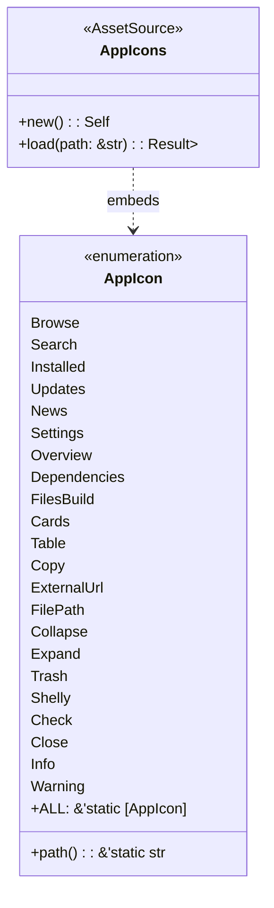

# Shelly GPUI — Slice-05 Visual System

## 1. Design Philosophy

The visual system for Shelly GPUI is designed to provide an austere, high-contrast, distraction-free desktop interface for system administration on Arch Linux. Rather than relying on generic web components, the interface leverages GPUI's GPU-accelerated rasterization with exact pixel alignment, clean geometric spacing, and bespoke vector iconography.

---

## 2. Color System & Theme Parity

The application defines two complete, balanced color themes in `src/theme.rs`: `Theme::dark()` (the default system theme) and `Theme::light()`. Every visual token is strictly mirrored between both themes to ensure complete parity in contrast and semantic meaning.

### 2.1 Theme Token Reference

| Semantic Token | Dark Mode (`#RRGGBB`) | Light Mode (`#RRGGBB`) | Usage / Meaning |
|---|---|---|---|
| `bg_app` | `#0f0f14` | `#f8fafc` | Deep desktop backdrop / canvas |
| `bg_sidebar` | `#0a0a0e` | `#f1f5f9` | Structural sidebar frame background |
| `bg_surface` | `#181822` | `#ffffff` | Elevated card & list item container |
| `bg_surface_hover` | `#232332` | `#e2e8f0` | Immediate pointer feedback background |
| `bg_surface_active`| `#2c2d40` | `#cbd5e1` | Selected navigation item / active toggle |
| `border` | `#262638` | `#e2e8f0` | Subtle 1px structural separator |
| `border_focus` | `#38bdf8` | `#0284c7` | Electric focus ring for keyboard navigation |
| `text_primary` | `#f1f5f9` | `#0f172a` | High-contrast body text & titles |
| `text_secondary` | `#94a3b8` | `#475569` | Balanced secondary labels & descriptions |
| `text_muted` | `#64748b` | `#94a3b8` | Captions, hints, and placeholder text |
| `accent` | `#38bdf8` | `#0284c7` | Primary brand accent & active states |
| `accent_hover` | `#7dd3fc` | `#0369a1` | Luminous accent hover state |
| `success` | `#10b981` | `#059669` | Successful completion / installed badge |
| `warning` | `#f59e0b` | `#d97706` | Pending operations / warning notices |
| `danger` | `#f43f5e` | `#e11d48` | Package removal / error state indicators |
| `danger_hover` | `#fb7185` | `#be123c` | Removal button hover state |
| `badge_alpm` | `#38bdf8` | `#0284c7` | Official repository / ALPM badge |
| `badge_aur` | `#a855f7` | `#7c3aed` | Arch User Repository (AUR) badge |
| `badge_flatpak` | `#06b6d4` | `#0891b2` | Flatpak sandbox container badge |
| `badge_appimage` | `#f97316` | `#ea580c` | Standalone AppImage container badge |

---

## 3. Vector Iconography (`src/icons/` & `src/icons.rs`)

All glyphs across the application are rendered from 22 single-path SVG files, embedded directly into the binary at compile time via `include_bytes!`. This eliminates runtime file system dependencies and ensures zero asset loading latency.



### Complete Icon Inventory

| Icon Variant | Asset Path | Visual Geometry & Purpose |
|---|---|---|
| `AppIcon::Browse` | `icons/browse.svg` | Grid of squares representing package repository exploration |
| `AppIcon::Search` | `icons/search.svg` | Magnifying glass for query filtering |
| `AppIcon::Installed` | `icons/installed.svg` | Archive box representing local packages |
| `AppIcon::Updates` | `icons/updates.svg` | Dual circular arrows representing package upgrades |
| `AppIcon::News` | `icons/news.svg` | Newspaper emblem for Arch Linux announcements |
| `AppIcon::Settings` | `icons/settings.svg` | Cogwheel gear representing application preferences |
| `AppIcon::Overview` | `icons/overview.svg` | Document text icon for package metadata overview |
| `AppIcon::Dependencies` | `icons/dependencies.svg` | Branching tree nodes representing dependency hierarchies |
| `AppIcon::FilesBuild` | `icons/files-build.svg` | Binary blocks representing files and PKGBUILD recipes |
| `AppIcon::Cards` | `icons/cards.svg` | Dual stacked cards for spacious view mode |
| `AppIcon::Table` | `icons/table.svg` | Tabular columns and rows for compact view mode |
| `AppIcon::Copy` | `icons/copy.svg` | Overlapping clipboards for copying commands/recipes |
| `AppIcon::ExternalUrl`| `icons/external-url.svg` | Arrow pointing out of square for external browser links |
| `AppIcon::FilePath` | `icons/file-path.svg` | Folder icon for desktop file paths |
| `AppIcon::Collapse` | `icons/collapse.svg` | Chevron left for collapsing the navigation drawer |
| `AppIcon::Expand` | `icons/expand.svg` | Chevron right for expanding the navigation drawer |
| `AppIcon::Trash` | `icons/trash.svg` | Wastebasket for package removal actions |
| `AppIcon::Shelly` | `icons/shelly.svg` | Distinctive geometric shell brand mark |
| `AppIcon::Check` | `icons/check.svg` | Checkmark for success alerts and saved states |
| `AppIcon::Close` | `icons/close.svg` | Cross glyph for dismissals and error alerts |
| `AppIcon::Info` | `icons/info.svg` | Circular info glyph for informative notifications |
| `AppIcon::Warning` | `icons/warning.svg` | Triangular hazard emblem for system warnings |

---

## 4. Density System (`src/ui_metrics.rs`)

Layout geometry is centrally controlled via `UiMetrics`, ensuring consistent spatial rhythm across differing density modes:

```rust
pub struct UiMetrics;

impl UiMetrics {
    // Package Card Heights
    pub const CARD_WRAPPER_NORMAL: f32 = 78.0;
    pub const CARD_HEIGHT_NORMAL: f32 = 72.0;
    pub const CARD_WRAPPER_COMPACT: f32 = 68.0;
    pub const CARD_HEIGHT_COMPACT: f32 = 62.0;

    // Table Row Heights
    pub const ROW_HEIGHT_HEADER: f32 = 32.0;
    pub const ROW_HEIGHT_NORMAL: f32 = 36.0;
    pub const ROW_HEIGHT_COMPACT: f32 = 32.0;

    // Splitter & Pane Boundaries
    pub const SPLITTER_WIDTH: f32 = 5.0;
    pub const LIST_MIN_WIDTH: f32 = 280.0;
    pub const INSPECTOR_MIN_WIDTH: f32 = 320.0;

    // Sidebar Geometry
    pub const SIDEBAR_EXPANDED: f32 = 190.0;
    pub const SIDEBAR_COLLAPSED: f32 = 56.0;
}
```

### Density Invariant Guarantees
1. **Vertical Space Utilization**: Compact card mode reduces height by $12.8\%$, allowing an additional 2 cards to remain visible simultaneously on a standard 1080p display.
2. **Tabular Density**: Table row height of 32px matches standard GNOME/KDE file manager list views, providing high information density for power users managing hundreds of installed packages.
3. **Splitter Protection**: The 5px wide splitter hit-target remains constant regardless of density mode to ensure touch and pointer precision.
