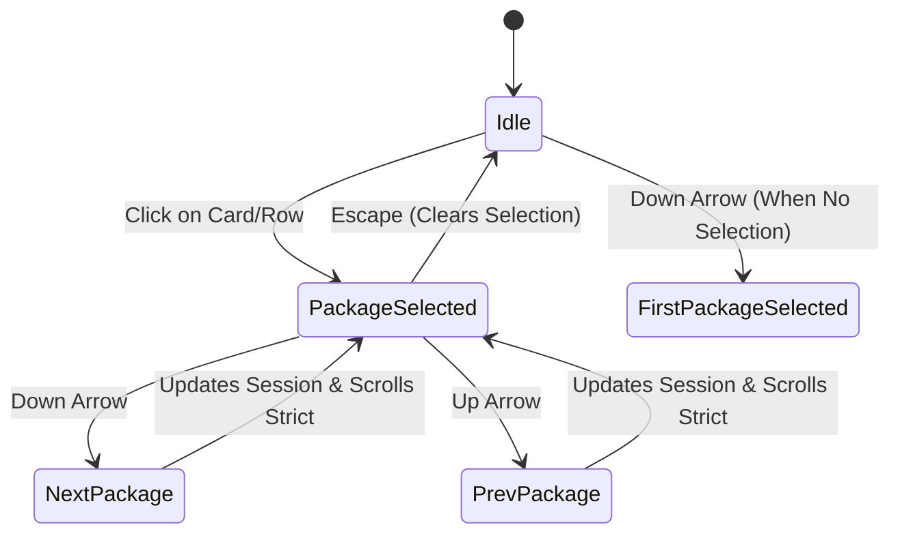

# Shelly GPUI — Slice-05 Interaction & Focus Model

## 1. Focus Management & Keyboard Navigation

The interaction design for Shelly GPUI balances direct mouse manipulation with efficient, non-blocking keyboard navigation for keyboard-first Linux desktop users.

---

## 2. Package List Keyboard Navigation

The virtual list (`UniformList`) in `PackageWorkstationView` implements arrow-key navigation driven by the root `WorkspaceView::on_key_down` handler:



### Key Bindings & Behavior
- **Down Arrow (`"down"`)**:
  - If no package is currently selected, selects the first package at index 0.
  - If a package is selected, increments the index, clamping at `packages.len() - 1`.
  - Dispatches `UniformListScrollHandle::scroll_to_item_strict(next_idx, ScrollStrategy::Top)` to ensure the newly selected package remains visible in the scroll viewport.
- **Up Arrow (`"up"`)**:
  - Decrements the selection index, saturating at 0.
  - Updates `AppSession.selected_package_key` and scrolls strictly to the index.
- **Escape (`"escape"`)**:
  - Clears `selected_package_key`, dismissing the active package inspector and returning focus to the primary list surface.
- **Tab Stops**:
  - Individual package cards and table rows are deliberately **not** tab stops. This prevents the user from being trapped in a cycle of hundreds of tab steps when navigating through large search results.

---

## 3. Focus Rings & Visual Feedback

To provide immediate accessibility and clear spatial orientation:
1. **Focus Ring Color**: Interactive elements display a crisp 1px outline or ring using `theme.border_focus` (Electric Cyan `#38bdf8` in dark mode, Deep Azure `#0284c7` in light mode).
2. **Tracked Root Surface**: The root `div().id("workspace_root")` tracks `self.search_focus` to capture window-level keystrokes without requiring continuous manual clicking.
3. **Primary Action Focus**:
   - `Save Settings` button renders an explicit focus state when targeted via Tab.
   - Segmented view mode buttons (`Cards`, `Table`) highlight active and focused states cleanly.
   - Filter pills (`All`, `Official`, `AUR`, `Flatpak`, `AppImage`) provide visual feedback on hover and focus.

---

## 4. Interactive Desktop Link-Out (`NewsView`)

In `NewsView`, Arch Linux news announcements represent critical system maintenance advisories (e.g. manual intervention requirements during pacman upgrades).

### Interaction Flow
1. Each news card checks for an active announcement URL (`ArchNewsItem.url`).
2. When present, the card is enhanced with:
   - `cursor_pointer()` style.
   - Subtle border highlight on pointer hover (`border_color(theme.accent)`).
   - An explicit "Open in browser" link indicator featuring `AppIcon::ExternalUrl`.
3. Left-clicking the card invokes:
   ```rust
   cx.open_url(&url);
   ```
   GPUI directs the platform's default browser (via XDG desktop portal / `xdg-open`) to display the complete announcement on archlinux.org.

---

## 5. Reversible Motion & Reduced-Motion Semantics

All interactive transitions respect the `reduce_motion` preference stored in `GpuiUiConfig`:
- **When `reduce_motion = false` (Default)**:
  - Sidebar expands/collapses smoothly via an isolated quadratic ease (`ease_out_quint`).
  - Terminal log drawer discloses smoothly using `AnimatedScalar`.
  - Workspace navigation destinations and inspector tabs cross-fade over `MotionDurations::FAST = 120ms`.
  - Toast alerts enter with an opacity fade over 120ms.
- **When `reduce_motion = true`**:
  - All transitions snap immediately with zero duration.
  - No RAF animation loops are scheduled.
  - Search pulsing indicators render as steady, non-animated status labels.
