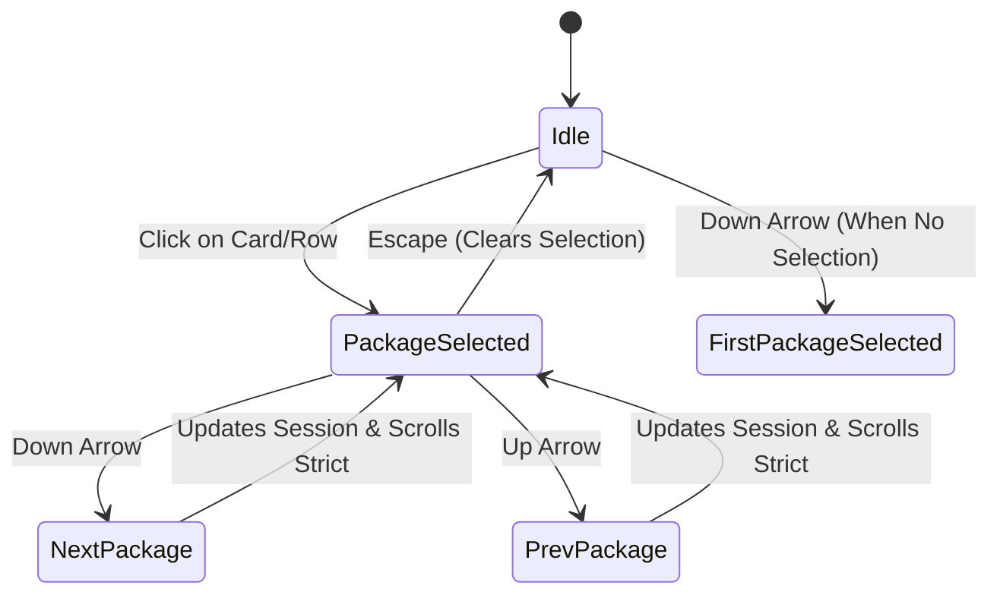

# Shelly GPUI — Slice-05 Interaction & Focus Model

## 1. Focus Management & Keyboard Navigation

The interaction design for Shelly GPUI balances direct mouse manipulation with efficient, non-blocking keyboard navigation for keyboard-first Linux desktop users.

---

## 2. Package List Keyboard Navigation

The virtual list (`UniformList`) in `PackageWorkstationView` implements arrow-key navigation driven by the root `WorkspaceView::on_key_down` handler:



### Key Bindings & Behavior
- **Down Arrow (`"down"`)**:
  - If no package is currently selected, selects the first package at index 0.
  - If a package is selected, increments the index, clamping at `packages.len() - 1`.
  - Dispatches `UniformListScrollHandle::scroll_to_item_strict(next_idx, ScrollStrategy::Top)` to ensure the newly selected package remains visible in the scroll viewport.
- **Up Arrow (`"up"`)**:
  - Decrements the selection index, saturating at 0.
  - Updates `AppSession.selected_package_key` and scrolls strictly to the index.
- **Escape (`"escape"`)**:
  - Clears `selected_package_key`, dismissing the active package inspector and returning focus to the primary list surface.
- **Tab Stops**:
  - Individual package cards and table rows are deliberately **not** tab stops. This prevents the user from being trapped in a cycle of hundreds of tab steps when navigating through large search results.

---

## 3. Focus Rings, Tab Stop Architecture & Keyboard Activation

To provide accessibility and clear spatial orientation without manufacturing transient `FocusHandle`s during render:
1. **GPUI 0.2.2 Element State Focus Model**:
   - Every primary interactive control is assigned a persistent, stable `.id(...)`.
   - Elements declare `.focusable()` and `.tab_stop(true)`. GPUI automatically manages, caches, and persists the internal `FocusHandle` in the element state across frames.
   - Elements apply discrete focus styling via `.focus(move |s| s.border_1().border_color(theme.border_focus))`, utilizing Electric Cyan `#38bdf8` in dark mode and Deep Azure `#0284c7` in light mode.
2. **Window Tab Cycle**:
   - `WorkspaceView::on_key_down` intercepts `"tab"`:
     - `Tab`: dispatches `window.focus_next()`.
     - `Shift-Tab` (`event.keystroke.modifiers.shift`): dispatches `window.focus_prev()`.
3. **Primary Interactive Controls Registered as Tab Stops**:
   - **Sidebar Destination Buttons** (`nav_dest_browse`, `nav_dest_installed`, `nav_dest_updates`, `nav_dest_news`, `nav_dest_settings`):
     - Focus ring with `border_focus`.
     - Keyboard activation: `Enter` or `Space` switches destination.
     - Collapsed Tooltip: renders `DestinationTooltip` via `.tooltip(...)` when sidebar is collapsed.
   - **Sidebar Collapse Toggle** (`sidebar_collapse_toggle`):
     - Focus ring with `border_focus`.
     - Keyboard activation: `Enter` or `Space` toggles sidebar expanded/collapsed state.
     - Tooltip: displays "Expand" / "Collapse" on hover.
   - **View Mode Switcher** (`view_mode_cards`, `view_mode_table`):
     - Focus ring with `border_focus`.
     - Keyboard activation: `Enter` or `Space` toggles between Cards and Table density modes.
   - **Settings Toggle Rows** (`setting_aur`, `setting_flatpak`, `setting_appimage`, `setting_cascade_delete`, `setting_remove_configs`, `setting_dark_theme`, `setting_compact_view`, `setting_reduce_motion`, `setting_log_drawer_auto_open`):
     - Focus ring on toggle pills with `border_focus`.
     - Keyboard activation: `Enter` or `Space` toggles the draft preference setting.
   - **Settings Action Buttons** (`reset_settings_btn`, `save_settings_btn`):
     - Focus ring with `border_focus`.
     - Keyboard activation: `Enter` or `Space` executes Reset or Save.
   - **News Announcement Cards** (`news_card`):
     - Focus ring with `border_focus` on URL-backed announcements.
     - Keyboard activation: `Enter` or `Space` invokes `cx.open_url(&url)`.
   - **Inspector Tabs** (`inspector_tab_overview`, `inspector_tab_dependencies`, `inspector_tab_files_build`):
     - Focus ring with `border_focus`.
     - Keyboard activation: `Enter` or `Space` activates the tab.
   - **Inspector Action Buttons** (`inspector_remove_btn`, `inspector_install_btn`, `inspector_copy_cmd_btn`):
     - Focus ring with `border_focus`.
     - Keyboard activation: `Enter` or `Space` triggers package mutation or copies install command to clipboard.
4. **Package List Non-Tab Stop Guarantee**:
   - Virtual list items (cards and rows) do **not** register as tab stops.
   - They remain navigable strictly via Up/Down arrow keys and click selection, preventing keyboard trap in large lists.

---

## 4. Interactive Desktop Link-Out (`NewsView`)

In `NewsView`, Arch Linux news announcements represent critical system maintenance advisories (e.g. manual intervention requirements during pacman upgrades).

### Interaction Flow
1. Each news card checks for an active announcement URL (`ArchNewsItem.url`).
2. When present, the card is enhanced with:
   - `cursor_pointer()` style.
   - Subtle border highlight on pointer hover (`border_color(theme.accent)`).
   - An explicit "Open in browser" link indicator featuring `AppIcon::ExternalUrl`.
3. Left-clicking the card invokes:
   ```rust
   cx.open_url(&url);
   ```
   GPUI directs the platform's default browser (via XDG desktop portal / `xdg-open`) to display the complete announcement on archlinux.org.

---

## 5. Reversible Motion & Reduced-Motion Semantics

All interactive transitions respect the `reduce_motion` preference stored in `GpuiUiConfig`:
- **When `reduce_motion = false` (Default)**:
  - Sidebar expands/collapses smoothly via an isolated quadratic ease (`ease_out_quint`).
  - Terminal log drawer discloses smoothly using `AnimatedScalar`.
  - Workspace navigation destinations and inspector tabs cross-fade over `MotionDurations::FAST = 120ms`.
  - Toast alerts enter with an opacity fade over 120ms.
- **When `reduce_motion = true`**:
  - All transitions snap immediately with zero duration.
  - No RAF animation loops are scheduled.
  - Search pulsing indicators render as steady, non-animated status labels.
