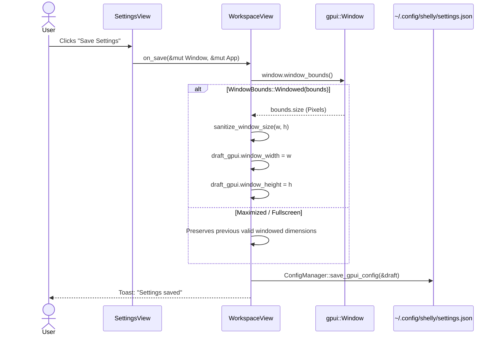

# Shelly GPUI — Slice-05 Configuration & Desktop Geometry

## 1. Separation of Configuration Authorities

The desktop environment maintains strict separation between the GPUI frontend preferences and the underlying Zig CLI configuration:

| Aspect | GPUI Frontend (`Shelly.Ui.Gpui`) | CLI Runtime Authority (`Shelly.Cli.Zig`) |
|---|---|---|
| **Location** | `~/.config/shelly/settings.json` | `~/.config/shelly/config.json` |
| **Schema Owner** | `src/config.rs` (`GpuiUiConfig`, `ShellySettings`) | `runtime/xdg.zig` |
| **Primary Keys** | `dark_theme`, `window_width`, `compact_view`, `reduce_motion` | `pacman_path`, `aur_helper`, `repos` |
| **Write Model** | Explicit Save button dispatch in Settings UI | Command line flags or interactive init |

This separation ensures that updates to frontend preferences never mutate, corrupt, or truncate low-level pacman or ALPM flags.

---

## 2. Hardened Deserialization & Defaults

Every field of `GpuiUiConfig` is annotated with `#[serde(default = "...")]` to guarantee that missing or malformed fields fall back deterministically to safe desktop defaults:

```rust
#[derive(Debug, Clone, Serialize, Deserialize, PartialEq)]
pub struct GpuiUiConfig {
    #[serde(default = "default_true")]
    pub dark_theme: bool,
    #[serde(default = "default_window_width")]
    pub window_width: f32,
    #[serde(default = "default_window_height")]
    pub window_height: f32,
    #[serde(default)]
    pub compact_view: bool,
    #[serde(default)]
    pub log_drawer_open: bool,
    #[serde(default = "default_log_drawer_height")]
    pub log_drawer_height: f32,
    #[serde(default)]
    pub last_selected_tab: usize,
    #[serde(default)]
    pub reduce_motion: bool,
}
```

If an empty JSON object (`{}`) or a legacy config from Slice-01/02 is read, deserialization succeeds without error and populates standard defaults:
- `dark_theme = true`
- `window_width = 1280.0`
- `window_height = 840.0`
- `compact_view = false`
- `log_drawer_open = false`
- `log_drawer_height = 220.0`
- `last_selected_tab = 0` (Browse)
- `reduce_motion = false`

---

## 3. Desktop Geometry Sanitization

To prevent corrupted or unusable windows (e.g., zero-size, off-screen, or negative dimensions created by faulty display managers), `ConfigManager::sanitize_window_size` enforces strict minimum bounds:

$$\text{MIN\_WINDOW\_WIDTH} = 1024.0\,\text{px}$$
$$\text{MIN\_WINDOW\_HEIGHT} = 680.0\,\text{px}$$

```rust
pub fn sanitize_window_size(width: f32, height: f32) -> (f32, f32) {
    let w = if width.is_finite() && width >= MIN_WINDOW_WIDTH {
        width
    } else {
        DEFAULT_WINDOW_WIDTH // 1280.0
    };

    let h = if height.is_finite() && height >= MIN_WINDOW_HEIGHT {
        height
    } else {
        DEFAULT_WINDOW_HEIGHT // 840.0
    };

    (w, h)
}
```

---

## 4. Discrete Window Bounds Sampling at Save

Rather than polling window dimensions continuously or installing invasive window resize event listeners that incur per-frame layout recalculations, geometry is sampled discretely when the user explicitly saves settings:



---

## 5. Workspace Tab Persistence & Safe Recovery

When saving preferences:
1. `last_selected_tab` is calculated from `AppSession.last_workspace_destination`:
   - `Browse => 0`
   - `Installed => 1`
   - `Updates => 2`
   - `News => 3`
   - `Settings => None` (never persisted)
2. If the user saves while actively viewing the Settings panel, the application persists their *previous* workspace destination (`last_workspace_destination`), ensuring they are never stranded in the Settings screen upon application relaunch.
3. Legacy index 4 (Settings in Slice-01) automatically defaults to 0 (`Browse`) via `NavDestination::from_config_index`.
