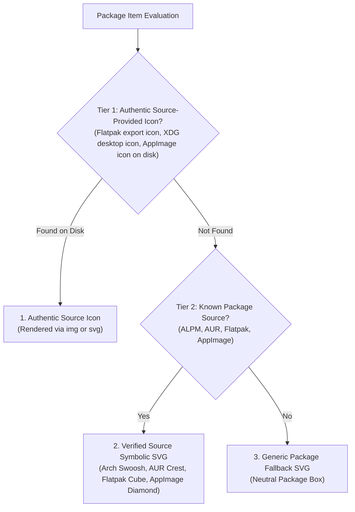

# 04 — Results Workbench & Package Identity (Phase UX-03)

## 1. Context & Executive Summary

Phase UX-02 and UX-02P established a frozen, production-grade **Command Surface** (`QueryWorkbench`), delivering a full-width search input, an unboxed resting toolbar with persistent 24px status rail, and zero floating pill chaos.

**Phase UX-03** addresses the central working surface of Shelly: the **Results Workbench**. This surface is where Linux power users, developers, and sysadmins discover, evaluate, compare, and manage packages.

### The 4 Canonical Axes of UX-03
1. **Package Identity Primitive**:
   - Deterministic resolution chain: Authenticated source-provided icon $\to$ Verified source symbolic icon $\to$ Generic package fallback.
   - **Absolute Zero Fake Logos Policy**: Never scrape the web, guess from arbitrary package names, or inject random third-party branding.
   - Stable container geometry with semantic source tinting.
2. **Information Hierarchy & Typographic Baseline**:
   - Predictable visual anchor: Name $\to$ Version $\to$ Source & Repo $\to$ Size $\to$ State.
   - Eradication of unaligned pill clusters. Truncation and alignment by deliberate design.
3. **Table as the Professional Canonical Surface**:
   - High-information density (1 row per package) as the primary workstation surface for Linux power users.
   - Strict column alignment, right-aligned numeric sizes, and inline source identity indicators.
   - Clean installation default: `Table` view mode by default for new installations, without clobbering existing `gpui-ui.json` configurations.
4. **Cards as a Genuinely Distinct View**:
   - Justify the 72px–80px spatial footprint through rich identity (36x36 avatar), multi-line context-rich descriptions (2 lines in normal mode), and tactile selection affordance.
   - A Card is not a table row wrapped in a border; it is an evaluation canvas.

---

## 2. Strict Scope Boundaries

To maintain software integrity and avoid regressions:
- **Command Surface is FROZEN**: `query_workbench.rs`, `search_input.rs`, `menu.rs`, and `view_mode_switcher.rs` are untouched.
- **Inspector is OUT OF SCOPE**: Detailed tabs, dependencies, files, and build scripts belong strictly to **Phase UX-04**.
- **Zero Deadcode Policy**: Strict enforcement of `#![deny(dead_code)]`, `#![deny(unused_variables)]`, `#![deny(unused_imports)]`, and `#![deny(unused_must_use)]`.

---

## 3. Axis 1: Package Identity Primitive

### 3.1 The Problem with Naive Package Displays
In naive software centers, packages either display no visual anchor at all (monotonous walls of text) or commit the fatal flaw of "fake logos" (heuristic web scraping, downloading random low-resolution images, or mapping package name prefixes to arbitrary brand assets).

### 3.2 The Strict 3-Tier Identity Resolution Chain
Shelly enforces a truthful, three-tier deterministic resolution chain:



1. **Tier 1 (Authentic Source Icon)**:
   - Flatpak packages probe `/var/lib/flatpak/exports/share/icons/hicolor/` and `~/.local/share/flatpak/exports/share/icons/hicolor/` for high-resolution PNG or SVG assets matching the App ID.
   - AppImage packages probe declared sibling assets or standard desktop icon locations.
   - Standard ALPM and AUR packages strictly require provenance verification: if installed, Shelly inspects `/var/lib/pacman/local/*/desc`, parses the `%NAME%` record field, guarantees that `%NAME% == pkg.name` exactly (preventing false prefix candidates like `python` matching `python-jinja`), reads that record's `files` list for owned `usr/share/applications/*.desktop` entries, extracts the `Icon=` field under `[Desktop Entry]`, and resolves the icon path.
   - Uninstalled packages, packages without owned desktop files, or non-desktop CLI tools honestly return Tier 2 Symbolic icons without guessing or name-based heuristics.
   - Hot-path rendering enforces `IdentityCache`: cached hits render in $O(1)$ memory; cache misses immediately return Tier 2 Symbolic in $O(1)$ with zero synchronous disk I/O and submit the key to a single bounded background worker queue (`shelly-identity-resolver`). Upon resolution, the worker emits `IdentityResolved(key)`, invalidating the UI surface reactively. Zero OS threads are created on the render path.
   - A single unified authority governs both proactive `preload()` (Browse search results, initial loads, refresh cycles) and on-demand cache-miss resolution, deduplicated by in-flight keys.
2. **Tier 2 (Verified Source Symbolic Vector)**:
   - High-contrast geometric vector glyphs for known sources: Arch Swoosh (`source-alpm.svg`), AUR Crest (`source-aur.svg`), Flatpak Cube (`source-flatpak.svg`), AppImage Diamond (`source-appimage.svg`).
3. **Tier 3 (Generic Fallback)**:
   - Neutral package box (`package-generic.svg`) for unknown sources or missing metadata.

### 3.3 Semantic Color Tinting & WCAG 2.1 AA Accessibility
Each source is assigned a distinct semantic identity token compliant with WCAG 2.1 AA contrast requirements:

| Package Source | Symbolic Glyph | Dark Theme Tint (`bg / border`) | Light Theme Tint (`bg / border`) | Contrast Ratio (vs Background) | Semantic Meaning |
| :--- | :--- | :--- | :--- | :--- | :--- |
| **ALPM** | Arch Swoosh | `rgb(0x38bdf8)` @ 12% / 28% | `rgb(0x0284c7)` @ 10% / 28% | $\ge 8.4:1$ (Dark) / $\ge 4.5:1$ (Light) | Official Arch Repositories (`core`, `extra`, `multilib`) |
| **AUR** | AUR Crest | `rgb(0xa855f7)` @ 12% / 28% | `rgb(0x7c3aed)` @ 10% / 28% | $\ge 5.0:1$ (Dark) / $\ge 4.5:1$ (Light) | Arch User Repository (Community PKGBUILDs) |
| **Flatpak** | Isometric Cube | `rgb(0x06b6d4)` @ 12% / 28% | `rgb(0x0891b2)` @ 10% / 28% | $\ge 8.0:1$ (Dark) / $\ge 4.5:1$ (Light) | Sandboxed Flathub / Remote Runtimes |
| **AppImage** | Portable Diamond | `rgb(0xf97316)` @ 12% / 28% | `rgb(0xea580c)` @ 10% / 28% | $\ge 6.7:1$ (Dark) / $\ge 4.5:1$ (Light) | Self-contained Executable Binaries |
| **Generic** | Package Box | `border` @ 50% | `border` @ 50% | Neutral | Unspecified / Fallback |

Status text labels utilize dedicated high-contrast text tokens (`success_text` and `warning_text`), mathematically proven $\ge 4.5:1$ against surface and app backgrounds in both light and dark modes, while status accent dots retain vibrant indicator hues.

---

## 4. Axis 2 & 4: Cards View Architecture

### 4.1 Card Geometry & Spatial Budget
- **Normal Mode**:
  - Row Wrapper Height: `88.0px` (`UiMetrics::CARD_WRAPPER_NORMAL` in uniform list)
  - Outer Wrapper Inset: `4.0px` top and bottom (`py_1()` in `package_workstation.rs`), giving $80 + 4 + 4 = 88\text{px}$. Note: this outer wrapper inset is distinct from the card's inner vertical padding.
  - Inner Card Height: `80.0px` (`UiMetrics::CARD_HEIGHT_NORMAL`)
  - Inner Card Padding: `12.0px` horizontal (`.px_3()`), `6.0px` vertical (`.py(px(6.0))`).
  - Avatar Dimensions: `36.0px` $\times$ `36.0px` with `6.0px` rounded corners.
- **Compact Mode**:
  - Row Wrapper Height: `70.0px` (`UiMetrics::CARD_WRAPPER_COMPACT` in uniform list)
  - Outer Wrapper Inset: `4.0px` top and bottom (`py_1()` in `package_workstation.rs`), giving $62 + 4 + 4 = 70\text{px}$.
  - Inner Card Height: `62.0px` (`UiMetrics::CARD_HEIGHT_COMPACT`)
  - Inner Card Padding: `12.0px` horizontal (`.px_3()`), `4.0px` vertical (`.py(px(4.0))`).
  - Avatar Dimensions: `28.0px` $\times$ `28.0px` with `4.0px` rounded corners.

### 4.2 Card Visual Layout & Desktop Metadata Line

```text
┌─[4px Accent]────────────────────────────────────────────────────────────────────────┐
│  ┌──────────┐  ripgrep                              14.1.0-1          1.8 MiB       │
│  │  [ALPM]  │  Arch · extra · ● Installed                                           │
│  │  Swoosh  │  Ultra-fast line-oriented search tool combining the usable ergonomics │
│  └──────────┘  of ag with the raw speed of grep.                                    │
└─────────────────────────────────────────────────────────────────────────────────────┘
```

1. **Left Visual Anchor**:
   - The `PackageIdentity` avatar occupies a fixed square container (`36px` normal, `28px` compact).
   - When selected, a `4px` electric cyan accent rail anchors the left edge.
2. **Right Content Column**:
   - **Line 1 (Header)**: Package Name in `FontWeight::BOLD`, `text_sm`, with `theme.text_primary` (or `theme.accent` when selected). The right side presents the Version and Size formatted with `.font_family("monospace")` for tabular scanning.
   - **Line 2 (Desktop Metadata Line)**: Eradication of candy pill badges. Displays a unified, calm desktop metadata string: `Arch · extra · ● Installed` (or `AUR · aur · Available`), with zero container borders or fills. The status dot (`●`) provides subtle color reinforcement without visual noise.
   - **Line 3 (Description)**: Enforces real GPUI multi-line clamping via `.line_clamp(if compact { 1 } else { 2 })`. In normal mode, renders up to 2 context-rich lines of package description (`text_xs`, `theme.text_secondary`), giving real substance to search results. In compact mode, cleanly clamped to 1 line.

---

## 5. Axis 2 & 3: Table View Architecture

### 5.1 The Table as Canonical Workstation Surface
For power users managing thousands of system packages, the Table view is the primary workhorse. It maximizes vertical scanning speed and provides instantaneous comparison of versions, repositories, and disk footprints.

### 5.2 Column Topology & Synchronized Metrics
Row Height:
- Normal Mode: `36.0px` (`UiMetrics::ROW_HEIGHT_NORMAL`)
- Compact Mode: `30.0px` (`UiMetrics::ROW_HEIGHT_COMPACT`)
- Header Height: `32.0px` (`UiMetrics::ROW_HEIGHT_HEADER`)

| Column | Header | Proportion / Width | Content Alignment | Visual Elements |
| :--- | :--- | :--- | :--- | :--- |
| **Col 1** | `NAME` | `flex_1` (expandable) | Left | 16x16 inline `PackageIdentity` glyph + Package Name |
| **Col 2** | `VERSION` | `105.0px` fixed | Left | Monospace font (`.font_family("monospace")`), `text_xs`, `text_muted` |
| **Col 3** | `SOURCE` | `105.0px` fixed | Left | Clean textual desktop format (`Arch / extra`, `AUR / aur`), zero chip pills |
| **Col 4** | `SIZE` | `80.0px` fixed | Right (`justify_end` + `pr_3`) | Monospace font (`.font_family("monospace")`), formatted size or neutral `—` |
| **Col 5** | `STATUS` | `85.0px` fixed | Left | Status text with subtle indicator dot (`● Installed`, `● Update`, or `Available`) |

### 5.3 Table Header & Row Synchronization
Header columns and row cells share the exact same width tokens (`105px`, `105px`, `80px`, `85px`) and padding (`px_3`), guaranteeing zero horizontal jitter or columnar misalignment.

---

## 6. View Mode Configuration & Clean Install Default

### 6.1 Configuration Persistence in `gpui-ui.json`
`PackageViewMode` is integrated directly into `GpuiUiConfig`:
```rust
#[derive(Debug, Clone, Serialize, Deserialize)]
pub struct GpuiUiConfig {
    // ...
    #[serde(default = "default_view_mode")]
    pub view_mode: PackageViewMode,
}

fn default_view_mode() -> PackageViewMode {
    PackageViewMode::Table
}
```

### 6.2 Strict Non-Regression Invariants
1. **Clean Installation**: When no `~/.config/shelly/gpui-ui.json` exists, Shelly launches in **Table** mode as the canonical professional surface.
2. **Existing Configuration Preservation**: If an existing `gpui-ui.json` is present without the `view_mode` field, Serde safely defaults to `Table`. If the user has explicitly selected `Cards`, their choice is loaded and preserved.
3. **Reactive Persistence**: Switching view modes via the toolbar `ViewModeSwitcher` immediately saves the new preference to `gpui-ui.json`.

---

## 7. Quality Gates & Acceptance Matrix

| Gate | Requirement | Target |
| :--- | :--- | :--- |
| **Unit Tests** | `cargo test --release --locked` | 100% passing, zero regressions |
| **Linter** | `cargo clippy --release --locked -- -D warnings` | 0 warnings, zero deadcode |
| **Packaging** | `makepkg -C -c -f` | Arch Linux native package built |
| **Wayland Verification** | Hyprland live runtime | Screenshots verifying Cards & Table view modes |
